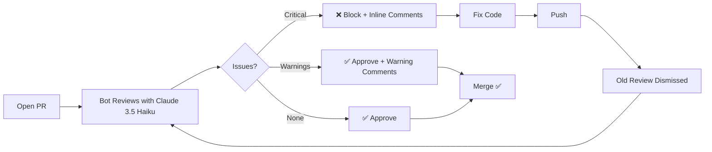
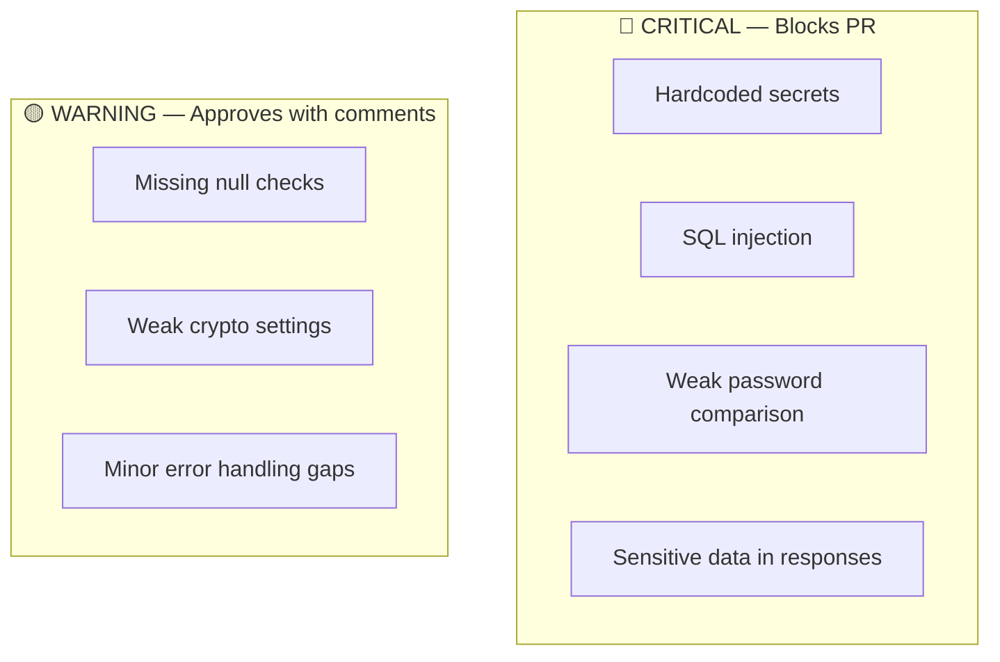

# pr-auto-approver-test

Test repository for the [pr-auto-approver](https://github.com/jonmatum/pr-auto-approver) bot.

## Bot Workflow

## Severity Levels

## Test Scenarios

| Directory | Language | What's Inside |
|-----------|----------|---------------|
| `python/` | Python | Flask API, JWT auth, ORM queries |
| `node/` | Node.js | Express server with security middleware |
| `terraform/` | HCL | AWS S3 bucket with encryption |
| `go/` | Go | HTTP health check server |

## Try It

1. Create a branch: `git checkout -b feat/my-test`
2. Add or modify code
3. Open a PR against `main`
4. Watch the bot review in ~10 seconds

## Related

| Repo | Description |
|------|-------------|
| [pr-auto-approver](https://github.com/jonmatum/pr-auto-approver) | Bot source (TypeScript) |
| [terraform-aws-pr-auto-approver](https://github.com/jonmatum/terraform-aws-pr-auto-approver) | Terraform module ([Registry](https://registry.terraform.io/modules/jonmatum/pr-auto-approver/aws)) |
| [pr-auto-approver-infra](https://github.com/jonmatum/pr-auto-approver-infra) | Deployment config |
